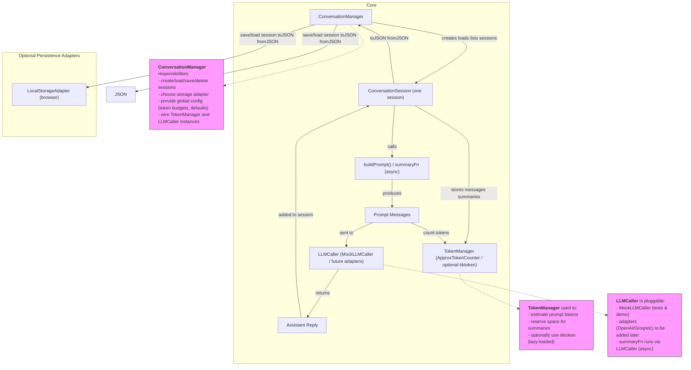

# CtxIQ

> Context and memory orchestration toolkit for building smarter AI assistants in TypeScript.

---

## 🚧 Status

**This project is under active development.**  
Expect frequent updates and breaking changes until the first stable release.  
Follow for progress or contribute!

free for dev
open source alternatives
