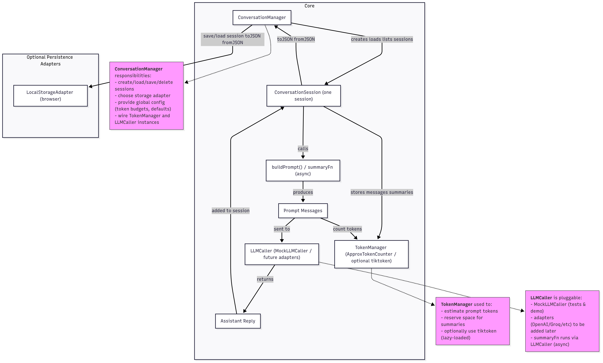

# CtxIQ

[](https://github.com/Programming-Sai/CtxIQ/actions/workflows/ci.yml)
[](./LICENSE)
[](https://www.npmjs.com/package/ctxiq)
[](#)
[](#)

Context and memory orchestration toolkit for building smarter AI assistants in TypeScript.

---

> [!WARNING] > **This project is under active development.**  
> Expect frequent updates and breaking changes until the first stable release.  
> Follow for progress or contribute!

## 

## 🧠 Overview / Motivation

Building AI assistants isn’t just about calling a model—it’s about **managing context**.  
Every real-world assistant must juggle ongoing conversations, control token budgets, and decide when to summarize or trim history.  
Without a structured toolkit, developers often reinvent fragile, one-off solutions for memory, persistence, and prompt construction.

**CtxIQ** solves this by providing a **lightweight, TypeScript-first toolkit** for context and memory orchestration.  
It gives you composable building blocks—session management, token counting, pluggable persistence, and an abstract LLM caller—so you can focus on _what_ your assistant does instead of _how_ it keeps track of the past.

Designed to be **framework-agnostic** and **fully typed**, CtxIQ works in Node.js, the browser, or serverless environments, making it a reliable foundation for chatbots, copilots, and any multi-turn AI experience.

---

## ✨ Features

- **Conversation Management** – Create, load, and persist multiple conversation sessions with a single manager.
- **Token Budgeting** – Estimate prompt tokens, reserve space for summaries, and prevent model overflow with pluggable counters.
- **Prompt Building** – Assemble clean, model-ready prompt messages with optional automatic summarization.
- **Extensible LLM Caller** – Swap in your own LLM provider (OpenAI, Groq, etc.) or use the included mock caller for testing.
- **Pluggable Persistence** – Save and restore sessions using adapters (e.g. browser `LocalStorage`) or roll your own.
- **React Hooks** – `useConversation` and `useSession` provide easy integration in React apps.
- **TypeScript First** – Fully typed API with clear interfaces and autocomplete support for a smooth developer experience.
- **Framework Agnostic** – Works in Node.js, browsers, and serverless runtimes without extra dependencies.

---

## ⚡ Quick Start

Install from npm:

```bash
npm install ctxiq
# or
yarn add ctxiq
```

Create a simple conversation session:

```typescript
import { ConversationManager } from "ctxiq";

// 1️⃣ Initialize a manager (optionally pass configs like token budgets)
const manager = new ConversationManager();

// 2️⃣ Create a session
const session = manager.createSession("demo-session");

// 3️⃣ Add a user message (ConversationSession will assign an id if you omit it)
session.addMessage({
  role: "user",
  content: "Hello, CtxIQ!",
  // tokens optional, the session will compute if missing
});

// 4️⃣ Build a prompt for your LLM (buildPrompt is async if you provide an async summarizer)
const promptMessages = await session.buildPrompt();

// 5️⃣ Optionally format for your provider (if you provided an llmFormatter, use getLLMMessages)
const providerInput = await session.getLLMMessages(); // returns provider-shaped array or default {role, content}[]

// 6️⃣ Send to your LLM of choice (pseudo-code)
const reply = await myLLM.call(providerInput); // your adapter handles provider specifics

// 7️⃣ Store the assistant’s reply back into the session
session.addMessage({
  role: "assistant",
  content: typeof reply === "string" ? reply : JSON.stringify(reply), // adapt as needed
});

console.log(session.toJSON());
```

---

## 🧩 Core Concepts

CtxIQ is built from small, composable pieces that work together:

- **ConversationManager** – The top-level orchestrator.  
  Creates, loads, lists, and deletes sessions. Handles global configuration like token budgets and storage adapters.

- **ConversationSession** – Represents a single ongoing conversation.  
  Stores messages, builds prompts, and triggers optional summarization.

- **TokenManager** – Estimates and tracks token usage.  
  Supports pluggable counters (approximation or tiktoken) to prevent overflow and reserve space for summaries.

- **LLMCaller** – Abstract interface for sending prompts to an LLM.  
  Includes a `MockLLMCaller` for tests and demos; real adapters (OpenAI, Groq, etc.) can be added as needed.

- **Persistence Adapters** – Optional storage layer (e.g. `LocalStorageAdapter`) for saving and restoring sessions across page loads or server restarts.

- **Prompt Builder** – Generates the final model-ready message array, automatically including summaries or trimming history based on token limits.

These components are **decoupled**: you can use only what you need, swap implementations, or extend with your own logic.

---

## 🔌 Adapters & Extensibility

CtxIQ is designed to be **flexible and extensible**, allowing you to swap or extend functionality without changing core logic:

- **Storage Adapters** – Persist session data anywhere:

  - `LocalStorageAdapter` (browser-ready)
  - IndexedDBAdaptor (planned)
  - Custom adapters (implement the `StorageAdaptor` interface)

- **LLM Adapters** – Connect to any LLM provider:

  - `MockLLMCaller` (built-in for testing)
  - OpenAI, Groq, or your custom provider
  - Supports streaming responses and generic input/output types

- **Token Managers** – Plug in different token counting strategies:

  - `ApproxTokenCounter` (fast, heuristic-based)
  - Optional `tiktoken` integration for exact counting

- **Formatter Functions** – Each LLM adapter can export helper formatters to convert `Message[]` into provider-specific input.

With this design, you can **mix and match adapters, token managers, and LLMs** to suit your application needs.

---

## 📚 Examples / Recipes

Here are some common patterns you can implement with CtxIQ:

### 1️⃣ Basic conversation flow

```ts
const manager = new ConversationManager();
const session = manager.createSession("example");

// add a user message
session.addMessage({ role: "user", content: "Hello!" });

// build prompt (async if summariser is async)
const prompt = await session.buildPrompt();

// format for provider or get default LLM messages
const llmInput = await session.getLLMMessages();

// send to a provider (adapter-specific)
const providerResp = await mockLLM.call(llmInput);

// store assistant reply
session.addMessage({
  role: "assistant",
  content:
    typeof providerResp === "string"
      ? providerResp
      : JSON.stringify(providerResp),
});
```

### 2️⃣ Persisting sessions in the browser

```ts
import { LocalStorageAdapter, attachStorageAdaptor } from "ctxiq";

const manager = new ConversationManager();
const storage = new LocalStorageAdapter();
attachStorageAdaptor(manager, storage);

const session = manager.createSession("persisted-demo");
```

### 3️⃣ Using a custom LLM adapter

- Implement the BaseLLMCaller interface (call<TIn,TOut> and optional stream)

- Export a formatter function to convert Message[] into provider input

- Inject your adapter into useSession or ConversationSession directly

---

## 📄 License

This project is licensed under the [MIT License](./LICENSE).

---

Thank you for checking out **CtxIQ**!  
Contributions, feedback, and suggestions are welcome — feel free to open issues or pull requests.  
Stay tuned for updates as we continue building features and improving the library.
